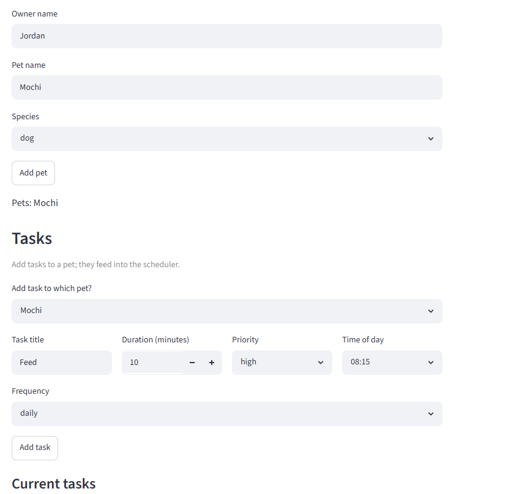
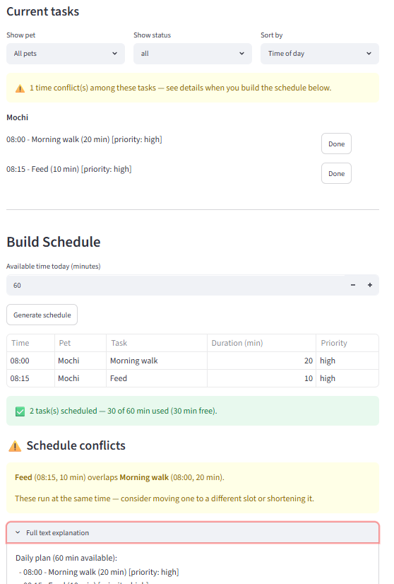
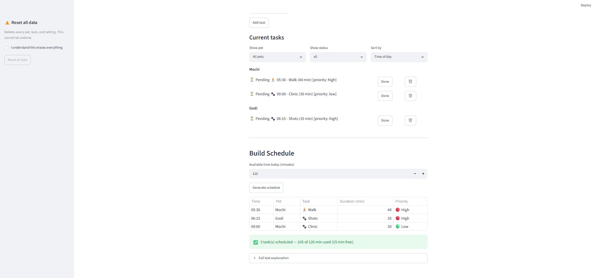

# PawPal+ (Module 2 Project)

You are building **PawPal+**, a Streamlit app that helps a pet owner plan care tasks for their pet.

## Scenario

A busy pet owner needs help staying consistent with pet care. They want an assistant that can:

- Track pet care tasks (walks, feeding, meds, enrichment, grooming, etc.)
- Consider constraints (time available, priority, owner preferences)
- Produce a daily plan and explain why it chose that plan

Your job is to design the system first (UML), then implement the logic in Python, then connect it to the Streamlit UI.

## What you will build

Your final app should:

- Let a user enter basic owner + pet info
- Let a user add/edit tasks (duration + priority at minimum)
- Generate a daily schedule/plan based on constraints and priorities
- Display the plan clearly (and ideally explain the reasoning)
- Include tests for the most important scheduling behaviors

## Getting started

### Setup

```bash
python -m venv .venv
source .venv/bin/activate  # Windows: .venv\Scripts\activate
pip install -r requirements.txt
```

### Suggested workflow

1. Read the scenario carefully and identify requirements and edge cases.
2. Draft a UML diagram (classes, attributes, methods, relationships).
3. Convert UML into Python class stubs (no logic yet).
4. Implement scheduling logic in small increments.
5. Add tests to verify key behaviors.
6. Connect your logic to the Streamlit UI in `app.py`.
7. Refine UML so it matches what you actually built.

## 🖥️ Sample Output

Paste a sample of your app's CLI or Streamlit output here so a reader can see what a generated plan looks like:

```
========================================================
Today's Schedule
Daily plan (60 min available):
  - 08:00 - Feed Whiskers (5 min) [priority: high]
  - 08:15 - Feed Buddy (7 min) [priority: high]
  - 09:00 - Walk Buddy (10 min) [priority: medium]
  - 17:00 - Play with Whiskers (15 min) [priority: low]
Total scheduled time: 37 min
========================================================
```

## 🧪 Testing PawPal+

```bash

The suite covers sorting, daily/weekly recurrence, and time-conflict detection, plus input validation and duplicate-task rejection — 59 tests at 100% coverage.

# Run the full test suite:
# python -m pytest

```
collected 76 items                                                                                                                                                                 

tests\test_pawpal.py ............................................................................                                                                              [100%]

================================================================================ 76 passed in 0.11s =================================================================================
  
```


# Run with coverage:
# pytest --cov
```
collected 76 items                                                                                                                                                                   

tests\test_pawpal.py ............................................................................                                                                              [100%]

================================================================================== tests coverage ===================================================================================
_________________________________________________________________ coverage: platform win32, python 3.13.13-final-0 __________________________________________________________________

Name                   Stmts   Miss  Cover
------------------------------------------
conftest.py                0      0   100%
pawpal_system.py         223      0   100%
tests\test_pawpal.py     366      0   100%
------------------------------------------
TOTAL                    589      0   100%
================================================================================ 76 passed in 0.30s =================================================================================
```
# Paste your pytest output here
```

## 📐 Smarter Scheduling

All methods below live on the `Scheduler` class.

| Feature           | Method(s)                                       | Notes                                                        |
|-------------------|-------------------------------------------------|--------------------------------------------------------------|
| Task sorting      | `sort_tasks()`, `sort_by_time()`                | Priority order for selection; time-of-day order for display. |
| Filtering         | `filter_tasks()`, `collect_tasks(pet_name=...)` | By completion status or by pet name.                         |
| Conflict handling | `find_conflicts()`                              | Flags overlapping time windows (warning only).               |
| Recurring tasks   | `complete_task()`, `next_due_date()`            | Spawns the next daily/weekly occurrence via `timedelta`.     |


## Features
- **Priority-based planning** — `generate_plan()` greedily packs tasks into the owner's available minutes, choosing higher-priority (and, as a tiebreaker, shorter) tasks first so the most important care happens when time is tight.
- **Sorting by priority** — `sort_tasks()` orders tasks by priority rank, then by shortest duration.
- **Sorting by time of day** — `sort_by_time()` orders tasks chronologically (parsing `HH:MM` to minutes), pushing unscheduled tasks to the end as "anytime" items.
- **Filtering** — `filter_tasks()` narrows by status (`all` / `pending` / `done`); `collect_tasks(pet_name=...)` scopes tasks to a single pet.
- **Conflict warnings** — `find_conflicts()` detects overlapping time windows between scheduled, incomplete tasks and reports them as warnings without dropping any task from the plan.
- **Daily & weekly recurrence** — completing a recurring task (`complete_task()`) automatically spawns its next occurrence, with `next_due_date()` advancing the due date by a day or a week via `timedelta`.
- **Plan explanation** — `explain_plan()` produces a human-readable breakdown of what was scheduled, the total time used, any conflicts, and what was skipped and why.
- **Input validation** — tasks reject non-positive durations and malformed/out-of-range times; owners reject negative available time, so invalid data fails loudly at construction.
- **Interactive Streamlit UI** — [`app.py`](app.py) surfaces sorting, filtering, conflict banners, and a schedule table wired to the `Scheduler`.

## 📸 Demo Walkthrough

### Main UI features & user actions

  - **Owner & Pets** — set the owner's name and **add pets** (name, species). Added pets are listed and persist across reruns.
  - **Tasks** — attach a task to a chosen pet with a title, **duration**, **priority** (low/medium/high), **time of day**, and **frequency** (daily/weekly/once). Duplicate and invalid tasks are rejected with a warning instead of crashing.
  - **Current tasks** — **filter** by pet and by status (all/pending/done), **sort** the view by time of day or by priority, and **mark tasks done** with a button (which queues the next occurrence for recurring tasks). An early banner warns if any tasks overlap.
  - **Build Schedule** — set the day's **available time** and **generate a plan**: a schedule table (Time / Pet / Task / Duration / Priority), a success summary of time used vs. free, per-conflict warning banners, a skipped-tasks breakdown, and a full text explanation.

### Example workflow

  1. Set the **owner name**, then add a pet — e.g. "Mochi" (dog).
  2. Add a task to Mochi: *Morning walk*, 20 min, high priority, 08:00, daily.
  3. Add a second task: *Feed*, 10 min, high priority, 08:15, daily.
  4. In **Current tasks**, sort by *Time of day* and see both listed; a heads-up warns they overlap.
  5. Under **Build Schedule**, set available time to 60 minutes and click **Generate schedule**.
  6. View today's schedule: a table in clock order, a "✅ 2 tasks scheduled — 30 of 60 min used" summary, and a conflict banner for the walk/feed overlap.
  7. Click **Done** on *Morning walk* — it's marked complete and tomorrow's walk is auto-created (daily recurrence).

### Key Scheduler behaviors shown

  - **Priority selection** — when time is short, `generate_plan()` keeps higher-priority (then shorter) tasks and skips the rest, listing skipped items with reasons.
  - **Sorting** — tasks display in clock order via `sort_by_time()`, while selection uses `sort_tasks()` (priority-first).
  - **Conflict warnings** — `find_conflicts()` flags overlapping time windows as individual warning banners; the plan is never silently altered.
  - **Recurrence** — completing a daily/weekly task spawns its next occurrence via `complete_task()` / `next_due_date()`.
  - **Filtering** — `filter_tasks()` and `collect_tasks(pet_name=...)` drive the pet/status views.

### Sample CLI output from running main.py
```
=== Tasks sorted by time of day ===
  08:00 - Feed Whiskers (5 min) [priority: high]
  08:00 - Feed Buddy (7 min) [priority: high]
  09:00 - Walk Buddy (10 min) [priority: medium]
  17:00 - Play with Whiskers (15 min) [priority: low]

=== Pending tasks only ===
  08:00 - Feed Whiskers (5 min) [priority: high]
  09:00 - Walk Buddy (10 min) [priority: medium]
  08:00 - Feed Buddy (7 min) [priority: high]

=== Buddy's tasks only ===
  09:00 - Walk Buddy (10 min) [priority: medium]
  08:00 - Feed Buddy (7 min) [priority: high]

========================================================
Today's Schedule
Daily plan (60 min available):
  - 08:00 - Feed Whiskers (5 min) [priority: high]
  - 08:00 - Feed Buddy (7 min) [priority: high]
  - 09:00 - Walk Buddy (10 min) [priority: medium]
Total scheduled time: 22 min
Conflicts (overlapping times):
  - Feed Whiskers overlaps Feed Buddy
Skipped:
  - 17:00 - Play with Whiskers (15 min) [priority: low] [done]
  ```

## Challenge 2: 💾 Data Persistence

PawPal+ remembers your pets and tasks between runs by saving them to a `data.json` file in the project root.

**Workflow**

1. **On startup**, the app calls `Owner.load_from_json("data.json")`. If the file exists, your owner, pets, and tasks are restored; if not (first run), it starts from a fresh default owner.
2. **On every change** — adding a pet or task, marking one done, deleting one, renaming the owner, or updating available time — the app auto-saves the full state back to `data.json`. No manual "save" step is needed.
3. **Next launch**, everything is loaded back exactly as you left it.

**How serialization works**

Rather than a library like `marshmallow`, PawPal+ uses lightweight custom dictionary conversion, since the classes are already dataclasses:

- Each class has `to_dict()` / `from_dict()`. The owner is the aggregate root, so serializing it captures the whole graph (owner → pets → tasks).
- The only field that isn't natively JSON-serializable is `Task.due_date` (a `datetime.date`), which is stored as an ISO string (`"2026-07-02"`) and parsed back with `date.fromisoformat`.
- `from_dict()` rebuilds objects through their normal constructors, so validation still runs — a corrupt saved value (e.g. a non-positive duration) fails loudly on load instead of slipping through.

**Files modified for this feature**

- [`pawpal_system.py`](pawpal_system.py) — added `to_dict()` / `from_dict()` on `Task`, `Pet`, and `Owner`, plus `Owner.save_to_json()` and `Owner.load_from_json()`.
- [`app.py`](app.py) — auto-loads `data.json` on startup and auto-saves after each change.
- [`tests/test_pawpal.py`](tests/test_pawpal.py) — added round-trip, file save/load, and corrupt-data tests.


## Challenge 3: Advanced Priority Scheduling

The work for priority sorting is already done. The application sorts by priority level. Each `Task` carries a **Low / Medium / High** priority, and `Scheduler.sort_tasks()` orders tasks high → medium → low (ranked via `PRIORITY_RANK`), using shorter duration as a tiebreaker. `generate_plan()` builds on this so that when time is limited, the highest-priority tasks are selected first. The UI also exposes this through the **Sort by → Priority** option in the Current tasks view.

### Sample CLI output showing advanced priority sorting
```
=== Tasks sorted by time of day ===
  07:30 - Give Whiskers meds (5 min) [priority: high]
  08:00 - Feed Whiskers (5 min) [priority: high]
  08:00 - Feed Buddy (7 min) [priority: high]
  09:00 - Walk Buddy (10 min) [priority: medium]
  10:00 - Groom Buddy (20 min) [priority: medium]
  16:00 - Brush Whiskers (10 min) [priority: low]
  17:00 - Play with Whiskers (15 min) [priority: low]

=== Tasks sorted by priority (High -> Low) ===
  08:00 - Feed Whiskers (5 min) [priority: high]
  07:30 - Give Whiskers meds (5 min) [priority: high]
  08:00 - Feed Buddy (7 min) [priority: high]
  09:00 - Walk Buddy (10 min) [priority: medium]
  10:00 - Groom Buddy (20 min) [priority: medium]
  16:00 - Brush Whiskers (10 min) [priority: low]
  17:00 - Play with Whiskers (15 min) [priority: low]

=== Pending tasks only ===
  08:00 - Feed Whiskers (5 min) [priority: high]
  07:30 - Give Whiskers meds (5 min) [priority: high]
  16:00 - Brush Whiskers (10 min) [priority: low]
  09:00 - Walk Buddy (10 min) [priority: medium]
  08:00 - Feed Buddy (7 min) [priority: high]
  10:00 - Groom Buddy (20 min) [priority: medium]

=== Buddy's tasks only ===
  09:00 - Walk Buddy (10 min) [priority: medium]
  08:00 - Feed Buddy (7 min) [priority: high]
  10:00 - Groom Buddy (20 min) [priority: medium]

========================================================
Today's Schedule
Daily plan (60 min available):
  - 07:30 - Give Whiskers meds (5 min) [priority: high]
  - 08:00 - Feed Whiskers (5 min) [priority: high]
  - 08:00 - Feed Buddy (7 min) [priority: high]
  - 09:00 - Walk Buddy (10 min) [priority: medium]
  - 10:00 - Groom Buddy (20 min) [priority: medium]
  - 16:00 - Brush Whiskers (10 min) [priority: low]
Total scheduled time: 57 min
Conflicts (overlapping times):
  - Feed Whiskers overlaps Feed Buddy
Skipped:
  - 17:00 - Play with Whiskers (15 min) [priority: low] [done] (already done)
========================================================

=== Recurring task auto-rescheduled ===
  Completed: 08:00 - Feed Buddy (7 min) [priority: high] [done]
  Next up:   08:00 - Feed Buddy (7 min) [priority: high] (due 2026-07-03)
  ```

## Challenge 4: Professional UI and Output Formatting

Both interfaces — the CLI demo (`main.py`) and the Streamlit app (`app.py`) — format tasks with emojis, color-coded indicators, and structured tables instead of plain text lines.

**Formatting features added**

- **Task-type emojis** — each task shows an icon for its kind of care 
- **Color-coded priority badges** — 🔴 High / 🟡 Medium / 🟢 Low, so importance reads at a glance.
- **Status indicators** — ✅ Done vs. ⏳ Pending for every task.
- **Structured tables** — the CLI renders bordered grids via `tabulate`; the Streamlit app shows the plan in an `st.table` with the same icons/badges, plus `st.success` / `st.warning` banners.
- **Section headers with emojis** — 📅 time view, ⭐ priority view, 🗓️ schedule, 🔁 recurrence.

**Functions and libraries used**

- **`formatting.py`** — a shared module so the CLI and Streamlit UI format consistently: `type_icon()` (keyword → emoji), `priority_badge()` (level → color-dot label), and `status_icon()` (done/pending).
- **[`tabulate`](https://pypi.org/project/tabulate/)** (added to `requirements.txt`) — the CLI's `task_table()` renders grids via `tabulate(rows, headers, tablefmt="rounded_grid")`.
- **Streamlit** — `app.py` applies the same helpers to its schedule table and task list; `st.success` / `st.warning` / `st.table` supply the visual structure.
- `sys.stdout.reconfigure(encoding="utf-8")` in `main.py` — forces UTF-8 output so emojis render in the Windows console (which defaults to cp1252).

**Sample formatted output**

```
📅  Tasks sorted by time of day
╭───────────┬──────────────────────┬────────┬────────────┬────────────╮
│ Status    │ Task                 │ Time   │ Duration   │ Priority   │
├───────────┼──────────────────────┼────────┼────────────┼────────────┤
│ ⏳ Pending │ 💊 Give Whiskers meds │ 07:30  │ 5 min      │ 🔴 High     │
├───────────┼──────────────────────┼────────┼────────────┼────────────┤
│ ⏳ Pending │ 🍽️ Feed Whiskers     │ 08:00  │ 5 min      │ 🔴 High     │
├───────────┼──────────────────────┼────────┼────────────┼────────────┤
│ ⏳ Pending │ 🍽️ Feed Buddy        │ 08:00  │ 7 min      │ 🔴 High     │
├───────────┼──────────────────────┼────────┼────────────┼────────────┤
│ ⏳ Pending │ 🚶 Walk Buddy         │ 09:00  │ 10 min     │ 🟡 Medium   │
├───────────┼──────────────────────┼────────┼────────────┼────────────┤
│ ⏳ Pending │ ✂️ Groom Buddy       │ 10:00  │ 20 min     │ 🟡 Medium   │
├───────────┼──────────────────────┼────────┼────────────┼────────────┤
│ ⏳ Pending │ 🧼 Brush Whiskers     │ 16:00  │ 10 min     │ 🟢 Low      │
├───────────┼──────────────────────┼────────┼────────────┼────────────┤
│ ⏳ Pending │ 🎾 Play with Whiskers │ 17:00  │ 15 min     │ 🟢 Low      │
╰───────────┴──────────────────────┴────────┴────────────┴────────────╯

⭐  Tasks sorted by priority (High → Low)
╭───────────┬──────────────────────┬────────┬────────────┬────────────╮
│ Status    │ Task                 │ Time   │ Duration   │ Priority   │
├───────────┼──────────────────────┼────────┼────────────┼────────────┤
│ ⏳ Pending │ 🍽️ Feed Whiskers     │ 08:00  │ 5 min      │ 🔴 High     │
├───────────┼──────────────────────┼────────┼────────────┼────────────┤
│ ⏳ Pending │ 💊 Give Whiskers meds │ 07:30  │ 5 min      │ 🔴 High     │
├───────────┼──────────────────────┼────────┼────────────┼────────────┤
│ ⏳ Pending │ 🍽️ Feed Buddy        │ 08:00  │ 7 min      │ 🔴 High     │
├───────────┼──────────────────────┼────────┼────────────┼────────────┤
│ ⏳ Pending │ 🚶 Walk Buddy         │ 09:00  │ 10 min     │ 🟡 Medium   │
├───────────┼──────────────────────┼────────┼────────────┼────────────┤
│ ⏳ Pending │ ✂️ Groom Buddy       │ 10:00  │ 20 min     │ 🟡 Medium   │
├───────────┼──────────────────────┼────────┼────────────┼────────────┤
│ ⏳ Pending │ 🧼 Brush Whiskers     │ 16:00  │ 10 min     │ 🟢 Low      │
├───────────┼──────────────────────┼────────┼────────────┼────────────┤
│ ⏳ Pending │ 🎾 Play with Whiskers │ 17:00  │ 15 min     │ 🟢 Low      │
╰───────────┴──────────────────────┴────────┴────────────┴────────────╯

⏳  Pending tasks only
╭───────────┬──────────────────────┬────────┬────────────┬────────────╮
│ Status    │ Task                 │ Time   │ Duration   │ Priority   │
├───────────┼──────────────────────┼────────┼────────────┼────────────┤
│ ⏳ Pending │ 🍽️ Feed Whiskers     │ 08:00  │ 5 min      │ 🔴 High     │
├───────────┼──────────────────────┼────────┼────────────┼────────────┤
│ ⏳ Pending │ 💊 Give Whiskers meds │ 07:30  │ 5 min      │ 🔴 High     │
├───────────┼──────────────────────┼────────┼────────────┼────────────┤
│ ⏳ Pending │ 🧼 Brush Whiskers     │ 16:00  │ 10 min     │ 🟢 Low      │
├───────────┼──────────────────────┼────────┼────────────┼────────────┤
│ ⏳ Pending │ 🚶 Walk Buddy         │ 09:00  │ 10 min     │ 🟡 Medium   │
├───────────┼──────────────────────┼────────┼────────────┼────────────┤
│ ⏳ Pending │ 🍽️ Feed Buddy        │ 08:00  │ 7 min      │ 🔴 High     │
├───────────┼──────────────────────┼────────┼────────────┼────────────┤
│ ⏳ Pending │ ✂️ Groom Buddy       │ 10:00  │ 20 min     │ 🟡 Medium   │
╰───────────┴──────────────────────┴────────┴────────────┴────────────╯

🐕  Buddy's tasks only
╭───────────┬────────────────┬────────┬────────────┬────────────╮
│ Status    │ Task           │ Time   │ Duration   │ Priority   │
├───────────┼────────────────┼────────┼────────────┼────────────┤
│ ⏳ Pending │ 🚶 Walk Buddy   │ 09:00  │ 10 min     │ 🟡 Medium   │
├───────────┼────────────────┼────────┼────────────┼────────────┤
│ ⏳ Pending │ 🍽️ Feed Buddy  │ 08:00  │ 7 min      │ 🔴 High     │
├───────────┼────────────────┼────────┼────────────┼────────────┤
│ ⏳ Pending │ ✂️ Groom Buddy │ 10:00  │ 20 min     │ 🟡 Medium   │
╰───────────┴────────────────┴────────┴────────────┴────────────╯

========================================================
🗓️  Today's Schedule
Daily plan (60 min available):
  - 07:30 - Give Whiskers meds (5 min) [priority: high]
  - 08:00 - Feed Whiskers (5 min) [priority: high]
  - 08:00 - Feed Buddy (7 min) [priority: high]
  - 09:00 - Walk Buddy (10 min) [priority: medium]
  - 10:00 - Groom Buddy (20 min) [priority: medium]
  - 16:00 - Brush Whiskers (10 min) [priority: low]
Total scheduled time: 57 min
Conflicts (overlapping times):
  - Feed Whiskers overlaps Feed Buddy
Skipped:
  - 17:00 - Play with Whiskers (15 min) [priority: low] [done] (already done)
========================================================

🔁  Recurring task auto-rescheduled
  Completed: ✅ Done  08:00 - Feed Buddy (7 min) [priority: high] [done]
  Next up:   ⏳ Pending  08:00 - Feed Buddy (7 min) [priority: high] (due 2026-07-03)


```

**Screenshots**:







